```mermaid
flowchart TD
%% ── VIP
    VIP["🎯 VIP kube-vip\n10.0.0.100"]
%% ── Masters (ngang hàng, giống Workers)
    subgraph Masters["Master Nodes"]
        direction LR
        CP1["CP-1\n10.0.0.11\n• kube-apiserver\n• controller\n• scheduler\n• kube-vip\n• kubelet"]
        CP2["CP-2\n10.0.0.12\n• kube-apiserver\n• controller\n• scheduler\n• kube-vip\n• kubelet"]
        CP3["CP-3\n10.0.0.13\n• kube-apiserver\n• controller\n• scheduler\n• kube-vip\n• kubelet"]
    end

%% ── ETCD cluster (ngang hàng)
    subgraph ETCD["etcd Cluster (HA)"]
        direction LR
        ETCD1["etcd-1\n10.0.0.21"]
        ETCD2["etcd-2\n10.0.0.22"]
        ETCD3["etcd-3\n10.0.0.22"]
    end

%% ── Workers (ngang hàng)
    subgraph Workers["Worker Nodes"]
        direction LR
        W1["Worker-1\n10.0.0.31\n• kubelet\n• kube-proxy\n• containerd\n• Calico"]
        W2["Worker-2\n10.0.0.32\n• kubelet\n• kube-proxy\n• containerd\n• Calico"]
        W3["Worker-3\n10.0.0.33\n• kubelet\n• kube-proxy\n• containerd\n• Calico"]
    end

%% ── VPN/Clients
    user --> kubectl --> VIP
%% ── Connections
    VIP --> CP1
    VIP --> CP2
    VIP --> CP3
    W1 --> VIP
    W2 --> VIP
    W3 --> VIP
    CP1 --> ETCD
    CP2 --> ETCD
    CP3 --> ETCD
    ETCD1 --- ETCD2 --- ETCD3

```

https://oteemo.com/blog/kubernetes-networking-and-services-101/
https://oteemo.com/blog/ingress-101-what-is-kubernetes-ingress-why-does-it-exist/
https://oteemo.com/blog/ingress-102-kubernetes-ingress-implementation-options/

https://kubeops.net/blog/achieving-high-availability-in-kubernetes-clusters
