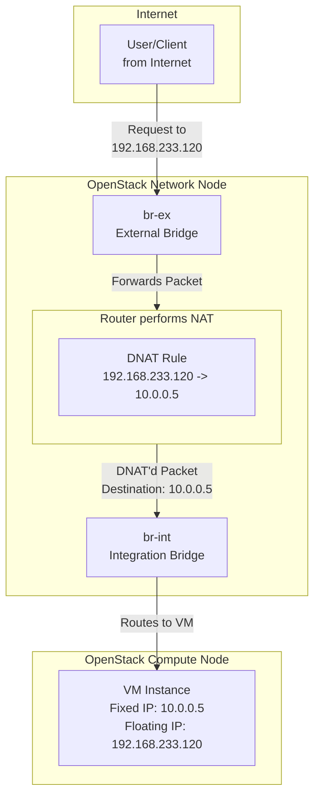

# **Floating IP và Floating IP Pool trong OpenStack & DevStack**

## **I. Khái Niệm Cốt Lõi**

### **1. Fixed IP vs. Floating IP**

- **Fixed IP**:
    - Địa chỉ IP private (ví dụ: `10.0.0.5`) được gán cố định cho máy ảo trên mạng nội bộ (internal network).
    - Dùng cho giao tiếp giữa các máy ảo trong cùng cloud.
    - **Không thể** truy cập trực tiếp từ Internet.

- **Floating IP**:
    - Địa chỉ IP "public" (có thể là thật hoặc ảo trong lab) được gán động cho máy ảo.
    - Hoạt động như một địa chỉ NAT, ánh xạ tới Fixed IP của máy ảo.
    - Cho phép truy cập vào máy ảo từ Internet (inbound) và máy ảo ra Internet (outbound).

### **2. Floating IP Pool là gì?**

- **Định nghĩa**: Một nhóm (pool) các địa chỉ Floating IP, được khai báo trong Neutron như một mạng external (có thuộc
  tính `router:external = True`).
- **Mục đích**:
    - Cung cấp nguồn IP "public" để gán cho các máy ảo.
    - Thực hiện cơ chế NAT giữa Fixed IP (private) và Floating IP (public).
    - Hỗ trợ cả kết nối inbound và outbound.

> **Lưu ý quan trọng**: Floating IP **không** được gán trực tiếp vào giao diện mạng của máy ảo. Thay vào đó, nó được ánh
> xạ tới Fixed IP của máy ảo thông qua router ảo (qrouter). Máy ảo thậm chí không biết sự tồn tại của Floating IP.

---

## **II. Kiến Trúc và Cơ Chế Hoạt Động**

### **1. Kiến Trúc Tổng Quan & Luồng Dữ Liệu**

Dưới đây là sơ đồ luồng dữ liệu khi một request từ Internet truy cập vào máy ảo thông qua Floating IP:

```
Internet -> br-ex (External Bridge) -> qrouter (Namespace, NAT) -> br-int (Integration Bridge) -> VM (Private IP + Floating IP)
```

sơ đồ default trong devstack được tạo sẵn:

```
Internet(devstack host) -> [br-ex: Public Network) -> [qrouter-xxxx] (NAT Gateway) -> [br-int: Public Network] -> [VM: 10.0.0.5 + FIP: 172.24.4.101]
```



### **2. Cơ Chế NAT Chi Tiết**

Khi gán Floating IP `192.168.233.120` cho VM `10.0.0.5`, Neutron tự động tạo các rule iptables trong namespace
`qrouter-xxxx`:

- **DNAT (Inbound)**:
  ```
  iptables -t nat -A PREROUTING -d 192.168.233.120 -j DNAT --to-destination 10.0.0.5
  ```
  *Chuyển hướng lưu lượng đến Floating IP thành Fixed IP của VM.*

- **SNAT (Outbound)**:
  ```
  iptables -t nat -A POSTROUTING -s 10.0.0.5 -j SNAT --to-source 192.168.233.120
  ```
  *Thay đổi địa chỉ nguồn của VM từ Fixed IP thành Floating IP khi ra ngoài.*

**Kiểm tra rule NAT:**

```bash
ip netns exec qrouter-xxxx iptables -t nat -L -n -v
```

---

## **III. Các Mô Hình Triển Khai Thực Tế**

### **1. DevStack Mặc Định (Mô Hình Ảo)**

**Mục đích:** Testing chức năng network cơ bản trong môi trường lab đơn lẻ.

**Cấu hình điển hình trong `local.conf`:**

```bash
FLOATING_RANGE=192.168.233.0/24
PUBLIC_NETWORK_GATEWAY=192.168.233.1
```

**Đặc điểm:**

- **Public network**: `192.168.233.0/24` (dải IP ảo)
- **Gateway**: `192.168.233.1`
- **Allocation pool**: `192.168.233.100 - 192.168.233.200`
- **Kết nối Internet thật**: ❌ Không
- **br-ex**: Chỉ là bridge ảo, không kết nối card vật lý.

**Kiểm tra:**

```bash
openstack network list --external
openstack subnet list --network public
ip a show br-ex
```

### **2. DevStack Bridged (Dùng IP Thật)**

**Mục đích:** Testing tính năng network trong điều kiện gần với thực tế, có kết nối Internet.

**Cấu hình:**

- **Cấu hình bridge trên host** (ví dụ trong `/etc/network/interfaces`):
    ```bash
    auto br-ex
    iface br-ex inet static
        address 103.168.20.210
        netmask 255.255.255.224
        gateway 103.168.20.193
        bridge_ports eth0  # <- Quan trọng: kết nối với card mạng vật lý
    ```

- **Cấu hình trong `local.conf`:**
    ```bash
    Q_USE_PROVIDERNET_FOR_PUBLIC=True
    PUBLIC_INTERFACE=br-ex
    ```

- **Tạo subnet external với dải IP public thật:**
    ```bash
    openstack subnet create public-subnet \
        --allocation-pool start=103.168.20.200,end=103.168.20.219 \
        --subnet-range 103.168.20.192/27 \
        --gateway 103.168.20.193 \
        --network public
    ```

**Ưu điểm:**

- VM có thể kết nối ra Internet thật.
- Cho phép kết nối từ Internet vào VM thông qua Floating IP.

### **3. OpenStack Production (Multi-node)**

**Đặc điểm:**

- Sử dụng dải IP public thật được cung cấp bởi ISP (ví dụ: `/26`, `/27`).
- Triển khai multi-node với các node network chuyên dụng chứa `br-ex`.
- Thường sử dụng các giao thức định tuyến (BGP/ECMP) cho khả năng mở rộng và dự phòng.
- NAT có thể được xử lý tập trung tại network node hoặc phân tán (DVR - Distributed Virtual Routing).

**Kiến trúc điển hình:**

```
Internet
    │
+-----------+
| br-ex     | (Network Node)
| 103.168.20.193/27 |
+-----------+
    │ (VXLAN/GRE Overlay Network)
+------------------+
|  br-int (Compute Node) |
|  VM: 10.0.0.5     |
|  FIP: 103.168.20.200 |
+------------------+
```

---

## **IV. Hướng Dẫn Thực Hành & Troubleshooting**

### **1. Các Lệnh Quản Trị Quan Trọng**

```bash
# Liệt kê các mạng external (Floating IP Pool)
openstack network list --external

# Liệt kê các subnet của mạng public
openstack subnet list --network public

# Xem danh sách Floating IP đã được gán
openstack floating ip list

# Kiểm tra cấu hình bridge
ip a show br-ex

# Liệt kê các network namespace
ip netns

# Kiểm tra rule NAT trong router
ip netns exec qrouter-xxxx iptables -t nat -L -n -v
```

### **2. Các Bước Gán Floating IP Cho VM**

```bash
# 1. Tạo một Floating IP từ pool
openstack floating ip create public

# 2. Liệt kê các port của VM để lấy fixed IP
openstack port list --server <vm_name_or_id>

# 3. Gán Floating IP cho port của VM
openstack floating ip set --port <port_id> <floating_ip>

# 4. Kiểm tra kết quả
openstack server show <vm_name_or_id>
openstack floating ip list
```

### **3. Sự Cố Thường Gặp và Cách Khắc Phục**

- **VM không ping được tới Internet**:
    - Kiểm tra security group cho phép ICMP.
    - Kiểm tra rule SNAT trong `qrouter` namespace.
    - Đảm bảo default gateway của VM đúng.

- **Không thể SSH vào VM qua Floating IP**:
    - Kiểm tra security group cho phép port 22.
    - Kiểm tra rule DNAT trong `qrouter` namespace.
    - Đảm bảo VM đang lắng nghe trên port 22.

- **Floating IP không thể gán**:
    - Kiểm tra còn Floating IP trong pool không (`openstack floating ip list`).
    - Đảm bảo router đã kết nối tới cả external network và internal network.

---

## **V. Tổng Hợp & So Sánh Các Mô Hình**

| Môi trường           | Nguồn Pool IP           | Kết nối vật lý  | Kết nối Internet thật | br-ex  | Mục đích sử dụng       |
|----------------------|-------------------------|-----------------|-----------------------|--------|------------------------|
| DevStack mặc định    | Dải IP ảo (192.168.x.x) | Không           | ❌ Không               | Ảo     | Test chức năng cơ bản  |
| DevStack bridged     | IP public thật          | br-ex -> eth0   | ✅ Có                  | Bridge | Test tính năng thực tế |
| OpenStack production | Dải IP từ ISP           | br-ex -> router | ✅ Có                  | Bridge | Vận hành production    |

---
